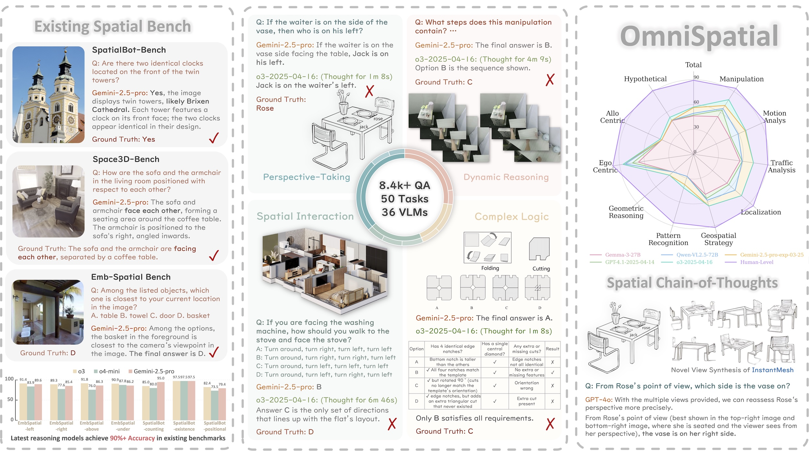
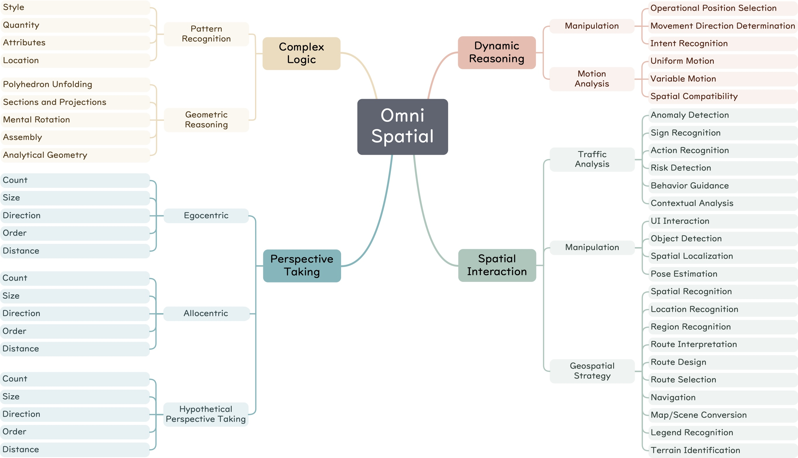

# OmniSpatial: Towards Comprehensive Spatial Reasoning Benchmark for Vision Language Models

> **OmniSpatial** diagnoses the limits of today's vision-language models (VLMs) on **higher-order spatial cognition**.  
> It spans **50 fine-grained tasks** grouped into **4 dimensions**—dynamic reasoning, complex spatial logic, spatial interaction and perspective-taking.

Mengdi Jia *, [Zekun Qi](https://qizekun.github.io/) *, Shaochen Zhang, [Wenyao Zhang](https://zhangwenyao1.github.io/), Xinqiang Yu, [Jiawei He](https://jiaweihe.com/), [He Wang](https://hughw19.github.io/) and [Li Yi](https://ericyi.github.io/).

[](https://qizekun.github.io/omnispatial/)
[](https://arxiv.org/abs/2506.03135)
[](https://huggingface.co/datasets/qizekun/OmniSpatial)



## 🌟 Highlights

| Dimension | Example Skills | % of QA |
|-----------|----------------|---------|
| **Dynamic Reasoning** | motion prediction, temporal ordering, manipulation planning | 27 % |
| **Complex Spatial Logic** | geometric transformations, pattern completion | 16 % |
| **Spatial Interaction** | collision checking, path planning, traffic analysis | 20 % |
| **Perspective Taking** | egocentric ↔ allocentric transforms, hypothetical views | 37 % |

* **Real-world diversity**: Internet images, driving-test frames, HOI4D videos, IQ tests  
* **Manual QA**: multi-round human annotation––no templates  
* **Challenging**: SOTA VLMs top out at **56.3 %** vs. human **92.6 %** accuracy  
* **Plug-and-play toolkit**: unified evaluation scripts for *open-source*, *closed-source*, and *reasoning* models  
* **Research Improvements**: `PointGraph` (scene-graph reasoning) and `Spatial CoT` (novel-view chain-of-thought)

---

## 🚀 Quick Start <a name="quick-start"></a>

<details>
<summary>Environment</summary>

```bash
# create conda env
conda create -n omnispatial python=3.12 -y
conda activate omnispatial

# clone repo
git clone https://github.com/qizekun/OmniSpatial.git
cd OmniSpatial
```
</details>

<details>
<summary>Install dependencies</summary>

**Open-source VLMs**

```bash
pip install torch==2.5.1 torchvision==0.20.1 transformers==4.49.0 qwen-vl-utils[decord]==0.0.8 triton accelerate timm
pip install flash-attn --no-build-isolation
```

**Closed-source (API) VLMs**

```bash
pip install openai==1.81.0
export OPENAI_API_KEY="sk-..."
# optional: export OPENAI_API_BASE="https://api.openai.com/v1"
```
</details>

<details>
<summary>Download dataset</summary>

```bash
# export HF_ENDPOINT="https://hf-mirror.com"
mkdir -p dataset
huggingface-cli download --resume-download qizekun/OmniSpatial --local-dir dataset --repo-type dataset
```
In this leaderboard, we use `OmniSpatial-test.zip`, and the `OmniSpatial-train.zip` is a larger version for training exploration.
The dataset is downloaded to `dataset/`, unzip `OmniSpatial-test.zip` and let the structure as follows:
```
dataset/
├── Complex_Logic/
├── Dynamic_Reasoning/
├── Perspective_Taking/
├── Spatial_Interaction/
└── data.json
```
</details>

<details>
<summary>Run evaluation</summary>

```bash
# Example: GPT-4.1 via OpenAI API
python api_eval.py --model_id gpt-4.1 --prompt_type manual_cot --eval_type re

# Example: local Qwen-VL-2.5-3B
cd vlm_eval
python qwenvl_eval.py --model_id Qwen/Qwen2.5-VL-3B-Instruct --prompt_type manual_cot --eval_type re

# Example: parallel evaluation
cd vlm_eval
python parallel_eval.py --model qwenvl --model_id Qwen/Qwen2.5-VL-3B-Instruct --group 8 --visible_nodes 0,1,2,3,4,5,6,7
```

Results are written to `result/{model_id}.json`.
</details>

---
## 📊 Leaderboard <a name="leaderboard"></a>

| Rank | Model                           | Overall ↑ | Dyn. | Interact | Logic | Persp. |
|------|---------------------------------|-----------|------|----------|-------|--------|
| 🥇   | o3-2025-04-16                   | **56.3**  | 70.9 | 65.3     | 35.4  | 53.6   |
| 🥈   | Gemini-2.5-Pro-05-06            | 55.2      | 68.2 | 67.7     | 39.4  | 44.6   |
| 🥉   | Gemini-2.5-Flash-Thinking-05-20 | 53.2      | 69.3 | 64.0     | 35.5  | 45.7   |
| …    | Human (upper-bound)             | **92.6**  | 95.2 | 93.5     | 87.9  | 94.4   |

*Full table in [our homepage](https://qizekun.github.io/omnispatial/).*

---

## 🗃️ Dataset Details <a name="dataset"></a>

OmniSpatial’s 50 fine-grained tasks span dynamic motion prediction, geometric logic, real-world traffic and object interaction analysis, map-level navigation planning, and egocentric, hypothetical, and allocentric perspective-taking for counting, size, direction, order, and distance, together forming a single benchmark that comprehensively probes spatial reasoning, multimodal perception, and decision-making across both 2D and 3D scenes.



| | Images / Clips | QA Pairs | #Tasks | License |
|---|---|---|---|---|
| OmniSpatial | **1 387** | **1 533** | **50** | CC BY-NC 4.0 |

* **Sources**: Web crawls (MIT-licensed or CC images), driving-test banks, HOI4D, MME
* **Annotation format**: JSON with fields:
  ```json
  {
    "id": "0_0",
    "question": "How long will it take for the moving car closest to the camera that captured this image to reach it if it's going at 10 m/s?",
    "options": ["2.7s", "14.7s", "25.7s", "3.9s"],
    "answer": 0,
    "task_type": "Dynamic_Reasoning",
    "sub_task_type": "Motion_Analysis"
  }
  ```
---

## 🔍 Evaluation Protocol <a name="evaluation"></a>

* **Multiple-choice**; accuracy is averaged over **5 seeds** to reduce randomness  
* **Evaluation Types**:
  - `direct`: Direct answer extraction
  - `re`: Regular expression pattern matching
  - `json`: JSON format parsing
  - `llm`: Using LLM (GPT-4.1-mini) as judge
* **Prompt Types**:
  - `none`: No system prompt
  - `zeroshot_cot`: Zero-shot chain-of-thought
  - `manual_cot`: Manual chain-of-thought

---

## 🛠️ Extensions

| Tricks | What it does |
|--------|--------------|
| **PointGraph** | Builds a **scene graph** from SAM + SAM-centers & Bounding Boxes |
| **Spatial CoT** | Generates **novel views** via InstantMesh & Zero1-2-3++ |

### PointGraph
```bash
cd pointgraph
pip install -r requirements.txt

# Example: openai api
python api_eval.py --model_id gpt-4.1 --eval_type re

# Example: local Qwen-VL-2.5-3B
python vlm_eval.py --model_id Qwen/Qwen2.5-VL-3B-Instruct --eval_type direct

# Example: parallel evaluation
python parallel_eval.py --model_id gpt-4.1 --group 8 --visible_nodes 0,1,2,3,4,5,6,7
```

### Spatial CoT
```bash
cd spatialcot
pip install -r requirements.txt

# Example: openai api
python api_eval.py configs/instant-mesh-large.yaml --model_id gpt-4.1

# Example: local Qwen-VL-2.5-3B
python vlm_eval.py configs/instant-mesh-large.yaml --model_id Qwen/Qwen2.5-VL-3B-Instruct
```

---

## 📜 Citation

If you find **OmniSpatial** useful, please cite:

```bibtex
@article{omnispatial25,
  title   = {OmniSpatial: Towards Comprehensive Spatial Reasoning Benchmark for Vision Language Models},
  author  = {Mengdi Jia and Zekun Qi and Shaochen Zhang and Wenyao Zhang and Xinqiang Yu and Jiawei He and He Wang and Li Yi},
  journal = {arXiv preprint arXiv:2506.03135},
  year = {2025}
}
```

---

## 📄 License

* **Code** — MIT License
* **Data** — CC BY-NC 4.0 (non-commercial research only)  
Please check individual images for additional constraints.

---

## 🙏 Acknowledgements

This project builds upon open-source efforts including **Segment Anything**, **InstantMesh**, **Qwen-VL**, **InternVL**, and the many contributors of the open-source VLM community. Special thanks to our annotator team for their meticulous QA work.
